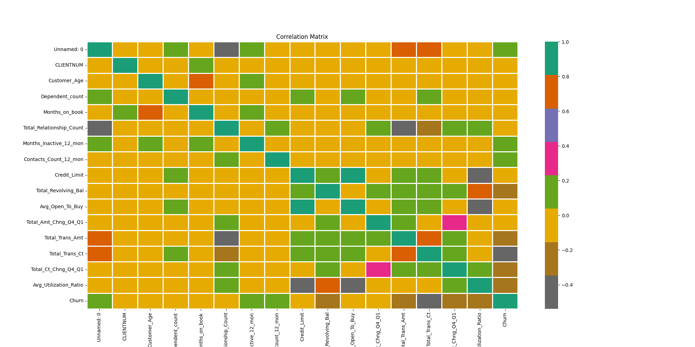
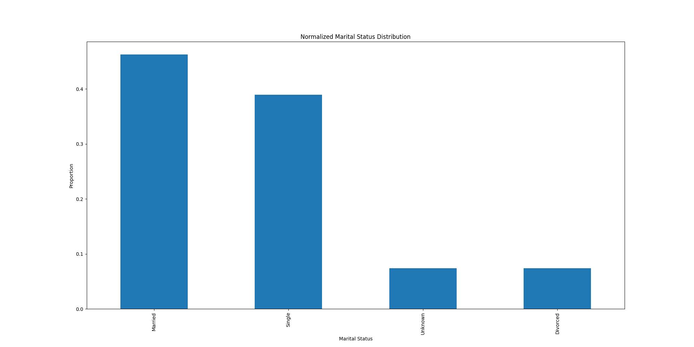

# 📊 Predict Customer Churn

This project is part of the **ML DevOps Engineer Nanodegree** by Udacity. It aims to predict customer churn for a bank using machine learning techniques. The workflow includes data preprocessing, exploratory data analysis (EDA), feature engineering, model training, evaluation, and logging.

---

## Certificate


## 📁 Project Structure

```
.
├── churn_library.py                  # Core functions for data processing, EDA, modeling, and evaluation
├── churn_script_logging_and_tests.py# Script for testing and logging
├── data/
│   └── bank_data.csv                 # Raw customer data
├── images/
│   ├── eda/                          # EDA visualizations
│   └── results/                      # Model evaluation plots and reports
├── logs/
│   └── churn_library.log             # Log file for test results
└── models/
    ├── logistic_model.pkl           # Trained Logistic Regression model
    └── random_forest_model.pkl      # Trained Random Forest model
```

---

## 📦 Requirements

A pip environment with 3.10 is required.

```bash
pip3.10 -m venv venv
```

Ensure the following Python libraries are installed:

```bash
pip install -r requirements_py3.10.txt
```

---

## 🚀 How to Run

### 1. Setup

Create the following directories in the project root:

````bash
mkdir -p images/eda and models ```

Place the `bank_data.csv` file inside the `data/` directory.

### 2. Run Main Script

Execute the main script to:

- Import and preprocess data
- Perform EDA and save plots to `images/eda/`
- Encode categorical variables and engineer features
- Split data into training and testing sets
- Train Logistic Regression and Random Forest models
- Generate evaluation reports and save to `images`
- Save trained models to `models/`

```bash
python churn_library.py
````

### 3. Run Tests and Logging

Run the test script to validate functionality and log results:

```bash
pytest churn_script_logging_and_tests.py
```

This will:

- Test key functions: `import_data`, `perform_eda`, `encoder_helper`, `perform_feature_engineering`, and `train_models`

---

## 📈 Outputs

- **EDA Visualizations**: Stored in `images/eda/`
- **Model Evaluation**: Classification reports, ROC curves, feature importance plots in `images`
- **Trained Models**: Saved as `.pkl` files in `models/`

---

## 📺 Screenhot

### eda

  
  





